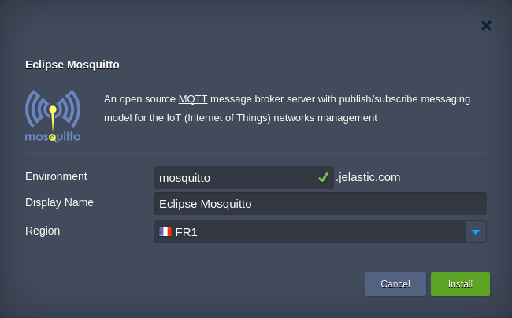
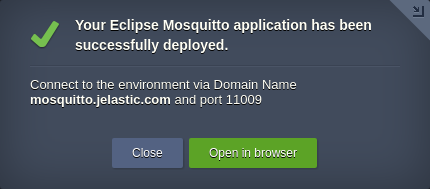

# Eclipse Mosquitto MQTT Message Broker

[Eclipse Mosquitto](https://mosquitto.org/) is a MQTT message broker to implement a lightweight publish/subscribe messaging model for M2M (machine to machine) telemetry in low-bandwidth environments. Allows to build IoT (Internet of Things) networks through interconnection of various instances and manage them with message interchange. 

## Eclipse Mosquitto Package Specifics

The current package is designed for the one-click Eclipse Mosquitto MQTT server setup. Upon its installation, a new environment with the following topology specifics is created: 
* contains a single Docker container with deployed [eclipse-mosquitto](https://hub.docker.com/r/_/eclipse-mosquitto/) image (_latest_ tag)
* the default scaling limit for the Eclipse Mosquitto container is set to 16 dynamic cloudlets, i.e. up to _2 GiB_ of RAM and _6.4 GHz_ of CPU (can be manually adjusted through [topology wizard](https://docs.jelastic.com/setting-up-environment), if needed)
* a dedicated [endpoint](https://docs.jelastic.com/endpoints) is automatically created to make your message broker available from anywhere over Internet (a  [Public IP](https://docs.jelastic.com/public-ipv4) address can be manually attached after installation for production usage)

## How to Install Eclipse Mosquitto into Jelastic Cloud

The deployment of the Eclipse Mosquitto package is a completely automated process, which allows to start your personal MQTT server in a matter of minutes. In case you don’t have Jelastic account yet, click the button below and provide your email within the opened page. Next, choose the prefered [Jelastic Public Cloud](https://jelastic.cloud/) to be automatically registered at and click **Install**. After confirmation via email, the package installation will be started.

As for the already registered users, this package can be easily [imported](https://docs.jelastic.com/environment-import) using link to the _**manifest.jps**_ file above, as well as installed from [Jelastic Marketplace](https://docs.jelastic.com/marketplace).

Within the opened installation frame, provide the desired _Environment_ name, optional _Display Name_ ([alias](https://docs.jelastic.com/environment-aliases)) and choose a hardware _[Region](https://docs.jelastic.com/environment-regions)_ (if several ones are available).

Click **Install** and wait a minute till Jelastic configures everything for you.

Here, your your MQTT server environment _domain name_ and _ports_ details are specified (required for connection of Mosquitto clients to this broker).
