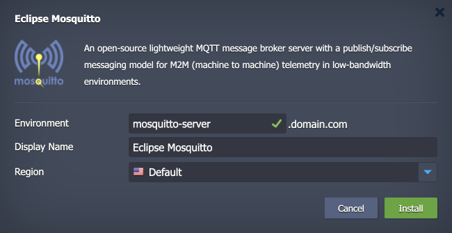

 

# Eclipse Mosquitto MQTT Message Broker

The package deploys the [Eclipse Mosquitto](https://mosquitto.org/) solution - an open-source and lightweight MQTT broker for IoT (Internet of Things) networks. It allows establishing a publish/subscribe messaging model for M2M (machine to machine) telemetry in low-bandwidth environments.

## Environment Topology

The current package is designed to set up the Eclipse Mosquitto MQTT server in one click. Upon its installation, a new environment with the following topology specifics is created:

- Contains a single Docker container based on the *latest* tag of the official [eclipse-mosquitto](https://hub.docker.com/_/eclipse-mosquitto) image.
- The default [vertical scaling](https://www.virtuozzo.com/application-platform-docs/automatic-vertical-scaling/) limit for the Eclipse Mosquitto container is set to *8 dynamic cloudlets* (up to *1 GiB* of RAM and *3.2 GHz* of CPU) and can be manually increased if needed.
- A dedicated [endpoint](https://www.virtuozzo.com/application-platform-docs/endpoints/) is automatically attached to a broker node, making it possible to access it from anywhere over the Internet. A [public IP](https://www.virtuozzo.com/application-platform-docs/public-ip/) address can be assigned after the installation for production usage.

## Deployment to Cloud

To get your Eclipse Mosquitto MQTT broker solution, click the "**Deploy to Cloud**" button below, specify your email address within the widget, choose one of the [Virtuozzo Public Cloud Providers](https://www.virtuozzo.com/application-platform-partners/), and confirm by clicking **Install**.

> If you already have a Virtuozzo Application Platform (VAP) account, you can deploy this solution from the [Marketplace](https://www.virtuozzo.com/application-platform-docs/marketplace/) or [import](https://www.virtuozzo.com/application-platform-docs/environment-import/) a manifest file from this repository.

## Installation Process

In the opened installation window at the VAP dashboard, provide a preferred environment and display names, choose a region (if available), and confirm the installation.

Your Eclipse Mosquitto application will be automatically installed in a few minutes.

> **Note:** For security reasons, you must set up the preferred [authentication method](https://mosquitto.org/documentation/authentication-methods/) before clients can connect to the broker.

Refer to the Virtuozzo [Eclipse Mosquitto](https://www.virtuozzo.com/application-platform-docs/eclipse-mosquitto-mqtt-server/) documentation to learn more about the solution and its configuration.
